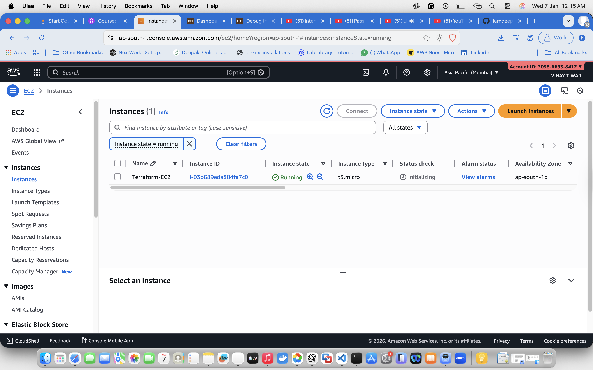
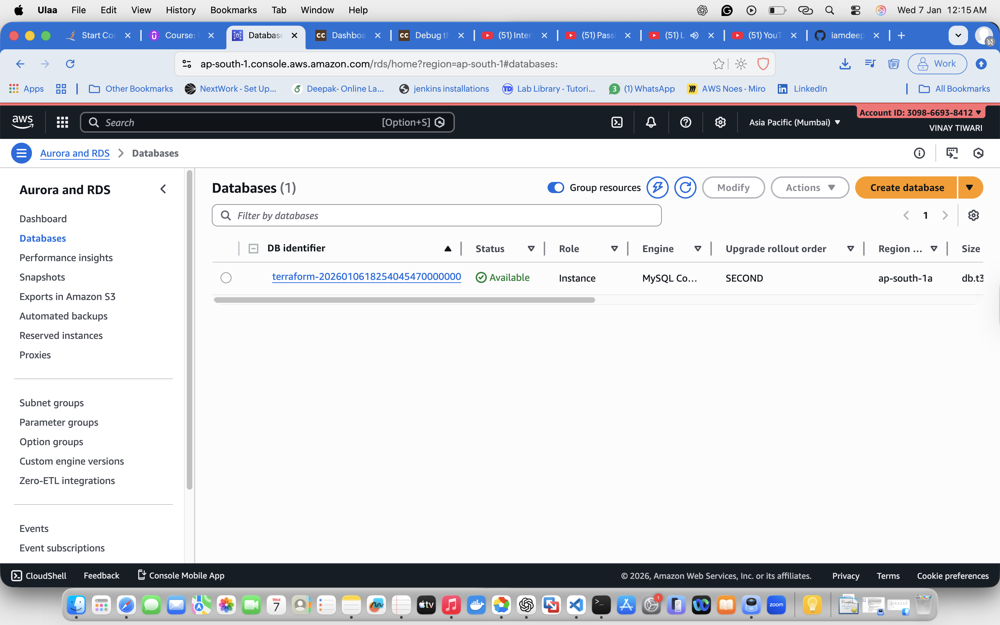
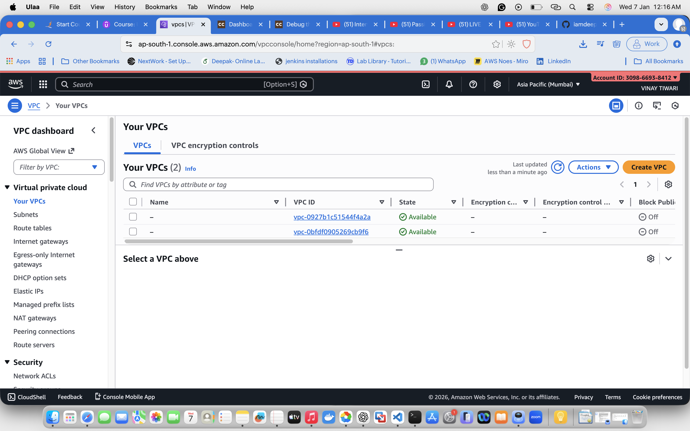

# Terraform AWS Infrastructure Project

## 📌 Overview
This project uses **Terraform (IaC)** to provision AWS infrastructure including:
- Custom VPC
- Public & Private Subnets (Multi-AZ)
- EC2 Instance
- RDS MySQL Database
- Security Groups
- Internet Gateway & Route Tables

## 🏗️ Architecture
- EC2 deployed in **public subnet**
- RDS deployed in **private subnets (2 AZs)**
- Infrastructure fully automated using Terraform

## 🛠️ Technologies Used
- Terraform
- AWS (EC2, VPC, RDS, IAM)
- Amazon Linux 2
- MySQL

## 📂 Project Structure

terraform-aws-project/
├── vpc.tf
├── ec2.tf
├── rds.tf
├── security.tf
├── provider.tf
├── variables.tf
├── outputs.tf
├── README.md
├── .gitignore

## 📸 Project Screenshots

### Terraform Apply Success


### EC2 Instance Running


### RDS Database Available


### VPC and Subnets


## 🚀 How to Deploy

```bash
terraform init
terraform validate
terraform plan
terraform apply

terraform destroy

DevOps | AWS | Terraform# terraform-aws-vpc-ec2-rds
